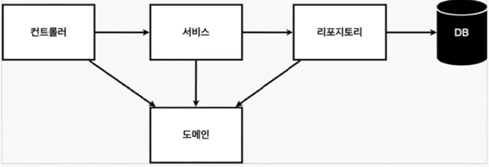
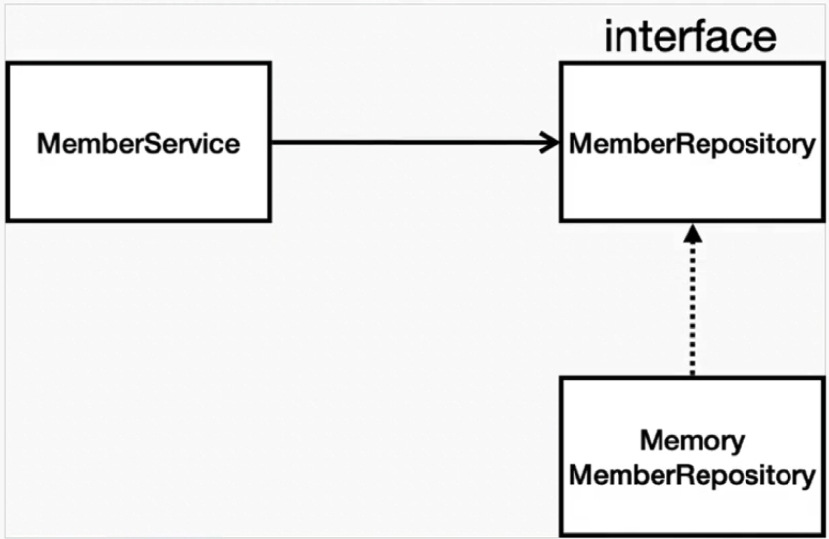

# hello-spring

## 🔍 진행 방식 (Live Document)

- 김영한 전 우아한 형제 CTO님의 스프링입문 영상 시청
- 노션에 정리, IDE(IntelliJ)내에서 실습하며 주석달기
- github에 푸시하고 프로젝트 관리 (README.md파일 및 리팩토링)

## 폴더 구조
```sh
hello-spring
├─ src 
   │  
   ├─ main    //chat client의 인스턴스를 구조화 함
   │    │
        └─  java  
              └─ (생략) hello.hellospring
                              └─ controller
                                      └─ HelloController.java // JSON방식으로 데이터 송수신
                              └─ domain
                                  └─ Member.java
                              └─ repository //회원 아이디를 저장, 찾는 기능
                                    └─ MemberRepository(Interface)
                                    └─ MemoryMemberRepository
                              └─ service   
                                    └─ MemberService  // 회원가입 && 전체회원 조회
   │    └─  resources
   └─ test    // test case에 관한 파일     
    │
    └─ ClientGUI.java   // chat client를 위한 UI 설계
    │
    │
    └─ SimpleChatClientFrame.java // 서버 UI와 서버 인스턴스의 생성
```
## 📮 진행 내용

- 비즈니스 요구사항
  - 데이터: 회원 ID, 이름
  - 기능: 회원 등록, 조회
  - 아직 데이터 저장소가 선정되지 않음 (**가상의 시나리오**)

### *일반적인 Web 어플리케이션의 구조*
- 
    - 컨트롤러: 웹 MVC와 컨트롤러의 역할
    - 서비스: 핵심 비즈니스 로직 구현로직들이 들어감
        - 회원은 중복되면 안된다등등…
    - 리포지토리(repository): 데이터베이스 접근, 도메인 객체를 DB에 저장하고 관리
    - 도메인: 비즈니스 도메인에 객체(예> 회원, 주문, 쿠폰) 등등 주로 데이터베이스에 저장하고 관리됨

### *클래스 의존 관계*

- Documentation
  - 아직 데이터 저장소가 선정되지 않아서, 우선 인터페이스로 구현 클래스를 변경할 수 있도록 설계
  - 데이터 저장소는 RDB, NoSQL 등등 다양한 저장소를 고민 중으로 <span style="color:blue">**가정**</span>
  - 개발을 진행하기 위해서는 초기 개발 단계에서는 구현체로 가벼운 메모리 기반의 데이터 장소 사용

## 🚨 회원 repository TC 작성

개발한 기능을 실행해서 테스트 할 때,
1. main method를 통해서 실행
2. 웹 어플리케이션의 컨트롤러를 통해서 실행
   할 수 있으나 다음과 같은 `**단점**`이 있다. 
   1. 오래 걸린다.
   2. 반복 실행하기 어렵다
   3. 여러 테스트를 한번에 실행하기 어렵다.

자바는 이러한 문제를 해결하기 위해 <span sttle="color:green"> **JUnit** </span>이라는 프레임워크로 테스트를 실행해서 이러한 문제를 해결한다.


## 디자인 패턴


## 🚀 더 조사하고 정리할 것들 (Live Document)
- <src/main>
- repository/MemoryMemberRepository.java
    <자료형>
  - Hashmap
    - 데이터 검색 및 조회: 키-쌍을 저장하는 자료구조로, 특정 키를 사용하여 값을 검색하고 조회하는 데 효과적이다.  
  - List
  <그 외>
  - sequence
  - Optional
  - IllegalState
  
  - 코드분석 
```java
    return store.values().stream()
                .filter(member -> member.getName().equals(name))
                .findAny();
```
- <src/test>
  - @AfterEach: 해당 어노테이션 안의 메소드는 @Test 어노테이션이 끝나면 반드시 실행이 됨.
    - MemoryMemberReposotory.java안의 @AfterEach는 테스트 한번 실행시 DB를 비우는 기능으로 활용됨.
---

## 🎯 알면 유용한 IntelliJ 단축키 및 꿀팁

- Alt + Enter : 
- Ctrl + Shift + Enter : 자동 완성 기능
- 블록 주석(/**/)과 한줄 주석(//) 색깔 변경 가능!
  - 나의 경우 블록 주석만 초록색으로 변경하여 코드 설명을 위한 더 가독성있는 요소를 고려함
- Ctrl + Shift + /: 주석처리(블록/**/)
- Ctrl + /: 주석처리 (//)

> 테스팅 관련

- Ctrl + Shift + T: 테스트 코드 자동생성 (테스트를 하고자 하는 클래스 이름에 입력)

---
